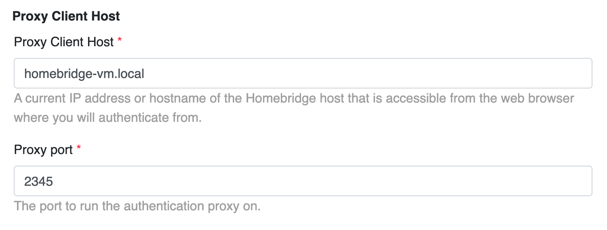
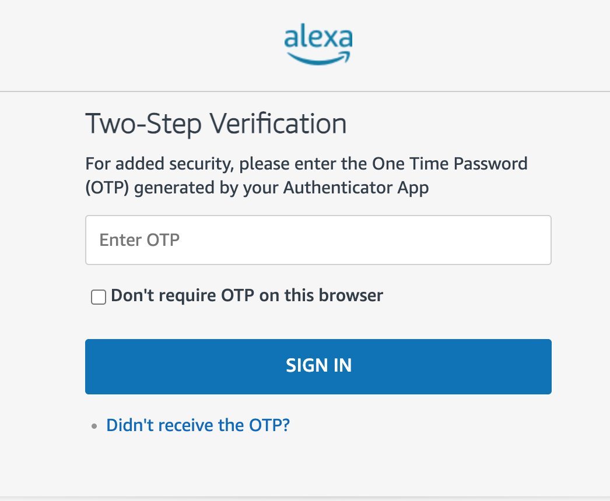

    

# Homebridge Alexa Smart Home

  

This is the home of the official homebridge-alexa-smarthome plugin. This plugin enables smart home device integration between HomeKit and Alexa. This allows HomeKit/Siri to control smart home devices that are connected via Amazon Alexa.

This plugin **does not** allow Alexa to control devices in HomeKit. For that, please see the [Homebridge Alexa](https://github.com/NorthernMan54/homebridge-alexa) plugin.

**Notice**

This plugin is in beta and has not been battle tested. Expect to encounter issues while using this plugin. Features and configuration options are subject to change. Please report all issues during the beta phase of this plugin so it can be improved for everyone. Pull requests welcome!

## Benefits

- Devices already linked to your Alexa account can be integrated with HomeKit automatically.
- Device groups created in the Alexa app can be integrated with HomeKit (possible but not yet supported). For example, a group of lights configured in Alexa could be automatically configured in HomeKit.
- Only Amazon credentials needed to configure this plugin rather than credentials for all your devices.
- This plugin does not store your Amazon username or password. Instead, it uses session cookies that are valid for up to 14 days.

## Initial configuration

The first time this plugin starts, you will need to authenticate using your Amazon Alexa account. Please follow these steps in order - screenshots included.

1. Verify that your plugin configuration is correct. Specifically, the proxy `clientHost` and `port` and the `amazonDomain`. The `clientHost` should be the same host you use to access homebridge. For example, if you access homebridge via the url `http://my-homebridge-server.local:8581` then `clientHost` should be `my-homebridge-server.local`. The `port` should be a different value from homebridge (not 8581).
   1. 
2. Check the homebridge logs for an error that you must manually open the url to authenticate.
   1. 
3. Visit the url in your browser to open a login screen. It is a real login screen proxied so the plugin can capture the session cookie. The username/password are not stored by the plugin.
   1. 
4. Enter your MFA code if you have MFA enabled on your Amazon Alexa account. Again, the plugin does not store this value.
   1. 
5. If successful, you should see a message that the Amazon Alexa cookie was successfully retrieved.
   1. 
6. The homebridge logs will also show a message such as "Successfully authenticated Alexa account".
   1. 

## Issues and Questions

If you run into issues or you need help please use the [issues template](https://github.com/joeyhage/homebridge-alexa-smarthome/issues/new/choose). Fill all the relevant sections and submit your issue. It is important that you use the templates because I will automatically be assigned to your issue and I will receive an email. If you use the blank template without assigning me, I will most likely miss the Github notification.
